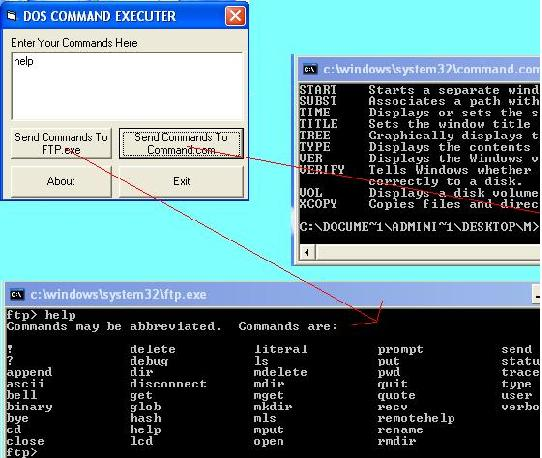



## Execute DOS Commands From Visual Basic

### Description

Well this has been made to teach you how to execute dos commands directly from visual basic application.   A more advanced use of this application can be made by using it in ftp applications to change the file types of cgi files using ftp.exe, this function is not available to you when you program a ftp client in visualbasic
 
### More Info
 
Well this has been made to teach you how to execute dos commands directly from visual basic application.   A more advanced use of this application can be made by using it in ftp applications to change the file types of cgi files using ftp.exe, this function is not available to you when you program a ftp client in visualbasic

             |
---                |---
**Submitted On**   |2004-06-30 22:10:16
**By**             |[ManuMehrotra](https://github.com/Planet-Source-Code/PSCIndex/blob/master/ByAuthor/manumehrotra.md)
**Level**          |Intermediate
**User Rating**    |4.0 (24 globes from 6 users)
**Compatibility**  |VB 6\.0
**Category**       |[Complete Applications](https://github.com/Planet-Source-Code/PSCIndex/blob/master/ByCategory/complete-applications__1-27.md)
**World**          |[Visual Basic](https://github.com/Planet-Source-Code/PSCIndex/blob/master/ByWorld/visual-basic.md)
**Archive File**   |[Execute\_DO176453712004\.zip](https://github.com/Planet-Source-Code/manumehrotra-execute-dos-commands-from-visual-basic__1-54691/archive/master.zip)

